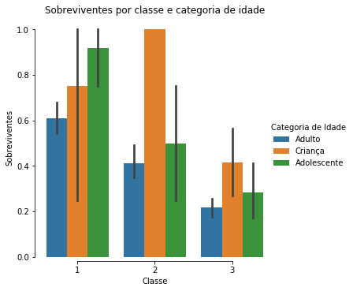
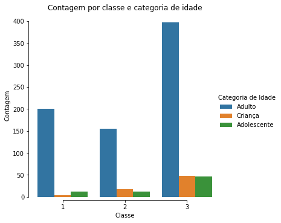
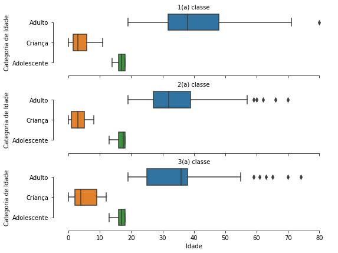
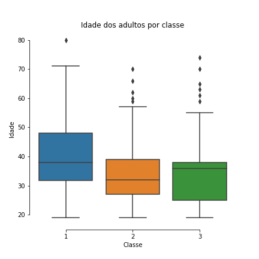
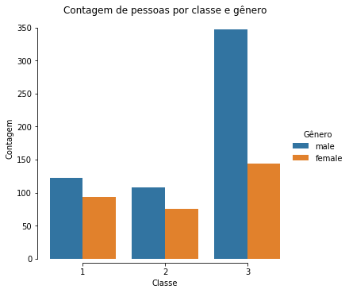
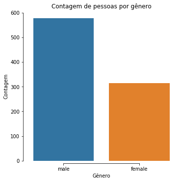
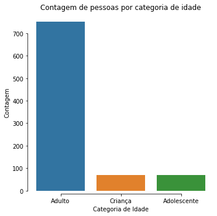
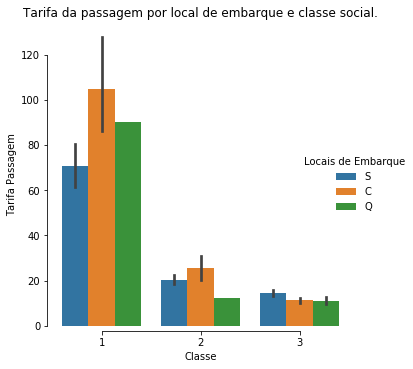

# 1. Projeto II - Fundamentos Data Science I

<!-- TOC -->

- [1. Projeto II - Fundamentos Data Science I](#1-projeto-ii---fundamentos-data-science-i)
    - [1.1. Notas](#11-notas)
    - [1.2. Perguntas Feitas](#12-perguntas-feitas)
    - [1.3. Limpeza dos dados](#13-limpeza-dos-dados)
    - [1.4. Analises e Resultados](#14-analises-e-resultados)
    - [1.5. Links uteis](#15-links-uteis)

<!-- /TOC -->

## 1.1. Notas

Todas as analises aqui presentes são resultados do dataset disponibilizado pelo curso de Fundamentos de Data Science I da Udacity. Essas analises são feitas de forma descritiva, apenas para estudo e não devem ser considerados como resultados fieis, para tal devem serem feitas outras analises e recomenda-se a utilização do método baseados em deep learning para definir corretamente os valores faltantes, que podem ser oriundos de erros humanos.

- O dataset utilizado foi titanic-data-6.csv e sua versão editada titanic_edited.csv
- As [perguntas feitas](#12-perguntas-feitas) estão na seção seguinte.
- As informações sobre a limpeza dos dados estão na seção [1.3](#13-limpeza-dos-dados).
- As análises e resultados finais se encontram na seção [1.4](#14-analises-e-resultados).
- A ultima seção [1.5](#15-links-uteis) contem links uteis de sites com informações que me ajudaram a completar o projeto.

## 1.2. Perguntas Feitas

- De que forma é composto o banco de dados. Quais são as classes das variáveis? Existem informações faltantes?
    + Para o tratamento dos dados e fazer a analise é necessário obter essas informações e saber a existem de valores discrepantes.

- Quais são as medidas descritivas? Qual é a contagem total para os dois gêneros? Qual é a contagem dos gêneros por classe? Como são distribuídos os passageiros por classe e por categoria de idade? Qual é a idade média dos passageiros por classe? Existem diferenças entre as idades médias dos passageiros por categoria de idade para cada classe?  Existem diferenças entre as categorias de idade? Qual foi o preço médio pago por passagem, por classe e por porto de embarcação?
    + Essas perguntas são importantes para analisar o perfil dos passageiros. Espera-se que existam diferenças significativas entre as classes, principalmente entre as classes extremas, primeira e terceira. É sabido que o Titanic foi de grande sucesso devido a propaganda luxuosa feita pela mídia e que essa fatídica viagem era a primeira com ele, devido a isso, espera-se que houvessem muitos passageiros da primeira classe embarcados.

- Será que mulheres e crianças possuem a maior taxa de sobrevivência no naufrágio? Por classe, qual foi a diferença de frequência da categoria de idade entre os sobreviventes e qual a relação disso pelo número total de passageiros, por classe e geral?
    + Como é esperado em acidentes, mulheres e crianças possuem preferencial no momento de fuga. Historicamente, sabe-se que muitos barcos de fuga foram lançados ao mar com pouquíssimas pessoas neles, portanto há interesse em saber se houve alguma diferença no número de sobreviventes entre cada classe e quantas pessoas sobreviveram no geral.

- A quantidade de adulto em cada classe?
    + Com a separação entre as três classes de passageiro e as categorias de idade, é possível investigar qual a probabilidade de se estar em qualquer uma das classes.

- A frequência de pessoas de diversas idades no Titanic e sua classe.

- A frequência de adultos em comparação as demais categorias de idade no barco.
    + A possibilidade de que existem mais adultos que as demais categorias é clara, mas e sua frequência em comparação as demais.

- Quais portos tem maior taxa de embarque e quais portos tem as menores taxas.
    + Agrupando as passagens, seus valores e o local de embarque é possível se ter a media dos portos que tiveram maior e menor taxa de embarque, como também a contagem de passageiros que cada porto recebeu no embarque do Titanic.

- Quais classes sociais tem os maiores números de pessoas por passagem.
    + Um agrupamento das passagens e contagem de nomes que fazem parte pode permitir descobrir quais passagens possuem uma maior quantidade de pessoas.

## 1.3. Limpeza dos dados

O programa responsável por fazer a limpeza dos dados é o arquivo `titanic_dataset_edit.py`, ele é responsável por fazer a maioria das modificações. Algumas modificações o programa não irá fazer pois foi necessário manter os dados no estado correto.

- Primeiro o programa apresenta as colunas, seus tipos e quantidade de dados que cada coluna possui. Com isso podemos analisar colunas com valores faltantes e colunas que não irão ser uteis para o projeto;
- Em seguida e verificada quantos itens únicos cada coluna tem;
- As colunas `PassengerId` e `Cabin` são removidas. A primeira contém apenas um índice que já é gerado ao se carregar o csv, a segunda tem apenas o código de cada cabine onde o passageiro dormiu e não é útil para as analises;
- A coluna `Pclass` é renomeada para `passenger_class` para melhorar a visualização, demais nomes são mantidos;
- Todas as colunas são renomeadas para ficaram em letras em minúsculo e alterar a separação entre palavras para sublinhado. Em seguida os nomes são revisados para verificar se estão corretos;
- É contado quantos valores de idade nulos existem por classe de passagem, é feito o calculo da média e aplicada a esses valores em branco para terem uma estimativa da idade;
- É criada uma nova coluna com a categoria da idade de cada passageiro, sendo: `Crianças` para pessoas com menos de 12 anos, `Adolescente` para pessoas com mais de 12 anos e menos de 18 anos e `Adulto` para todos que tiverem idade maior que 18 anos;
- Ao final é gerado um novo dataset contendo os registros editados.
- No programa que gera as tabelas, uma nova coluna temporária foi adiciona representando a frequência de indivíduos em uma passagem.


## 1.4. Analises e Resultados

**Tabela 1** - Passageiros por classe social, total de indivíduos por categoria de idade e sobreviventes da categoria.

| passenger_class | age_category | survived |
|----------------:|--------------|:--------:|
| 1               | Adolescente  | 11       |
| 1               | Adulto       | 122      |
| 1               | Criança      | 3        |
| 2               | Adolescente  | 6        |
| 2               | Adulto       | 64       |
| 2               | Criança      | 17       |
| 3               | Adolescente  | 13       |
| 3               | Adulto       | 86       |
| 3               | Criança      | 20       |
| total           | -            | 342      |

```
Total de passageiros por classe:
Total de pessoas da 1(a) classe no titanic: 216.
Total de pessoas da 2(a) classe no titanic: 184.
Total de pessoas da 3(a) classe no titanic: 491.
Total de sobreviventes: 891.

Porcentagem de sobreviventes por classe:
Porcentagem de sobreviventes da 1(a) classe: 62.96%.
Porcentagem de sobreviventes da 2(a) classe: 47.28%.
Porcentagem de sobreviventes da 3(a) classe: 24.24%.
Porcentagem de sobreviventes do naufrágio: 38.38%.

Porcentagem por classes de sobreviventes:
Porcentagem da 1(a) classe: 39.77%.
Porcentagem da 2(a) classe: 25.44%.
Porcentagem da 3(a) classe: 34.80%.
Total de sobreviventes: 342.
```

A *Tabela 1* demonstra que a grande maioria dos sobreviventes do naufrágio do Titanic, em todas as classes de passageiros, são adultos, sendo a grande maioria pertencentes a primeira classe. Esses dados consideram que 30 pessoas não identificadas da primeira classe são da categoria adulta, por intermédio da substituição dos Nas pela de média entre a quantidade de passageiros dessa classe. Ainda sabemos que o total desses sobreviventes somam 342 passageiros.

A *Figura 1* ajuda a esclarecer visualmente a porcentagem de sobreviventes entre cada categoria e sua classe de passageiro.

**Figura 1** - Gráfico de sobreviventes por classe e categoria de idade.



**Figura 2** - Gráfico de contagem de passageiros por classe e categoria de idade.



Na *Figura 2* observa-se que a população de passageiros era constituída, na maior parte, por adultos. Para todas as categorias de idade, observa-se maior discrepância de valores na terceira classe em relação as demais. Observa-se ainda que a população de crianças na primeira classe foi a menor entre as classes.

**Figura 3** - Gráfico de caixa de categoria de idade por classe.



O mesmo é observado na *Figura 3*, com informações adicionais de que existem outliers na categoria adultos em todas as classes (*Figura 11*). Observa-se também que existe pouca variabilidade dentro das categorias, exceto para criança na primeira e terceira classe, adolescente na segunda classe e adultos na terceira classe.

**Figura 4** - Gráfico de caixa entre idade de passageiros adultos e classe social.



**Figura 5** - Gráfico de frequência da primeira classe.


O primeiro gráfico de frequência na *Figura 5* representando a primeira classe apresenta uma distribuição simétrica e a maior frequência observada é de adultos com idade variando de 35 a 40 anos. No segundo e terceiro gráficos de frequência da *Figura 5* observam-se assimetrias positivas, sendo que no terceiro gráfico a maior frequência de idade varia de 40 a 45 anos e pertence a categoria adulta.

**Figura 8** - Gráfico de contagem de passageiros por classe e gênero.



**tabela 2** - Passageiros por classe, total de indivíduos por sexo e sobreviventes da categoria.

| passenger_class | sex    | total | survived |
|----------------:|--------|:-----:|:--------:|
| 1               | female | 94    | 91       |
| 1               | male   | 122   | 45       |
| 2               | female | 76    | 70       |
| 2               | male   | 108   | 17       |
| 3               | female | 144   | 72       |
| 3               | male   | 347   | 47       |

A *Tabela 2* mostra que existe mais homens e mulheres na terceira classe, como observado anteriormente nas *Figuras 2 e 8*. A maioria dos sobreviventes são do gênero feminino, *Tabela 4*, sendo que a primeira e segunda classe quase todas as passageiras sobreviveram. Esses dados podem ser reafirmados pela *Figura 8*, que mostra a contagem de passageiros a bordo, com uma discrepância de passageiros do gênero masculino na terceira classe.

**Tabela 3** - Contagem de passageiros por classe e sobreviventes.

| passenger_class | total | survived |
|----------------:|:-----:|:--------:|
| 1               | 216   | 136      |
| 2               | 184   | 87       |
| 3               | 491   | 119      |

A *Tabela 3* demonstra que a grande maioria, com o dobro de passageiros da primeira classe pertencia a terceira classe, porém aproximadamente 1/4 sobreviveu, enquanto a primeira classe teve uma sobrevivência maior que 50%.

**Figura 9** - Contagem de passageiros por classe.


**Tabela 4** - Total de indivíduos por gênero e sobreviventes.

| sex    | total | survived |
|:-------|:-----:|:--------:|
| female | 314   | 233      |
| male   | 577   | 109      |

A *Tabela 4* demonstra que os passageiros eram majoritariamente do gênero masculino, como também é observado na *Figura 10*, com maior sobrevivência de pessoas do gênero feminino. O que indica que mulheres tiveram uma maior taxa de sobrevivência comparado a homens, o que é esperado em um acidente dessas proporções.

**Figura 10** - Contagem de pessoas por gênero.



**Tabela 5** - Contagem de pessoas por categoria de idade e sobreviventes

| age_category | total | survived |
|:-------------|:-----:|:--------:|
| Adolescente  | 70    | 30       |
| Adulto       | 752   | 272      |
| Criança      | 69    | 40       |

A grande maioria dos passageiros era da categoria adulta, com a minoria sendo de crianças e adolescentes (*Figura 11*). Os adultos tiveram a maior taxa de morte devido seu maior número, porém mais de 50% dos adolescentes faleceram no naufrágio, no total 57,97% das crianças, 37,52% dos adultos e 42,86% dos adolescentes sobreviveram como pode ser observado na *Tabela 5*. Assim a maior taxa de sobrevivência não é de adultos e sim de crianças, com quase 58% de sobrevivência.

**Figura 11** - Contagem de pessoas por categoria de idade.




**Tabela 6** - Descritiva da categoria de idade dos passageiros.

| age_category | count | mean              | std                | min  | 25%  | 50%  | 75%                | max  |
|--------------|-------|-------------------|--------------------|------|------|------|--------------------|------|
| Adolescente  | 70.0  | 16.57857142857143 | 1.4386882972218642 | 13.0 | 16.0 | 17.0 | 18.0               | 18.0 |
| Adulto       | 752.0 | 35.21651467055594 | 10.613821418618652 | 19.0 | 27.0 | 36.0 | 38.233440860215055 | 80.0 |
| Criança      | 69.0  | 4.770579710144927 | 3.390390348885739  | 0.42 | 2.0  | 4.0  | 8.0                | 12.0 |

A *Tabela 6* mostra a descritiva das categorias de idade, No geral, a idade média dos adolescentes é de, aproximadamente, 17 anos (desvio de 1.44), mínimo de 13 anos e máximo de 18 anos; os adultos possuem, aproximadamente, 35 anos (desvio de 10.61), com mínimo de 19 anos e máximo de 80 anos; e as crianças possuem a idade média de, aproximadamente, 5 anos (desvio de 3.39), com mínimo de 0.42 meses e máximo de 12 anos. A *Tabela 7* separa a descritiva das categorias de idade entre as classes de passageiro, por ela é possível verificar que adultos da primeira classe são os mais velhos, com idade media de 40 anos, já adolescentes tem pouca variação na média de idade por classe, assim como na categoria infantil.

**Tabela 7** - Descritiva da categoria de idade dos passageiros por classe.

| age_category | passenger_class | count | mean               | std                | min  | 25%   | 50%                | 75%                | max  |
|--------------|-----------------|-------|--------------------|--------------------|------|-------|--------------------|--------------------|------|
| Adolescente  | 1               | 12.0  | 16.666666666666668 | 1.3026778945578592 | 14.0 | 16.0  | 17.0               | 18.0               | 18.0 |
| Adolescente  | 2               | 12.0  | 16.75              | 1.712255291076124  | 13.0 | 16.0  | 17.5               | 18.0               | 18.0 |
| Adolescente  | 3               | 46.0  | 16.51086956521739  | 1.423958217375397  | 13.0 | 16.0  | 17.0               | 18.0               | 18.0 |
| Adulto       | 1               | 200.0 | 40.20251612903226  | 12.184442955973504 | 19.0 | 31.75 | 38.233440860215055 | 48.0               | 80.0 |
| Adulto       | 2               | 155.0 | 34.3810828997572   | 10.599676082201874 | 19.0 | 27.0  | 32.5               | 39.0               | 70.0 |
| Adulto       | 3               | 397.0 | 33.030851277051006 | 8.81627325913373   | 19.0 | 25.0  | 36.0               | 38.233440860215055 | 74.0 |
| Criança      | 1               | 4.0   | 4.48               | 4.530077262034281  | 0.92 | 1.73  | 3.0                | 5.75               | 11.0 |
| Criança      | 2               | 17.0  | 3.4899999999999998 | 2.5219659989777816 | 0.67 | 1.0   | 3.0                | 5.0                | 8.0  |
| Criança      | 3               | 48.0  | 5.248333333333334  | 3.510292667275633  | 0.42 | 2.0   | 4.0                | 9.0                | 12.0 |

A tabela 7 é uma descritiva dos passageiros agrupada por categoria de idade

**Tabela 8** - Média de valor da passagem por local de embarque e sua classe.

| passenger_class | embarked | fare_mean          | total |
|----------------:|:--------:|--------------------|:------|
| 1               | C        | 104.71852941176469 | 85    |
| 1               | Q        | 90.0               | 2     |
| 1               | S        | 70.36486220472443  | 127   |
| 2               | C        | 25.358335294117644 | 17    |
| 2               | Q        | 12.35              | 3     |
| 2               | S        | 20.327439024390245 | 164   |
| 3               | C        | 11.214083333333337 | 66    |
| 3               | Q        | 11.183393055555557 | 72    |
| 3               | S        | 14.64408300283288  | 353   |

Na *Tabela 8* podemos ver uma separação dos valores médios das passagens em cada posto de embarque do Titanic. Sendo C (Cherbourg), Q (Queenstown) e S (Southampton). As passagens mais caras da primeira classe foram compradas em Cherbourg (*Figura 13*), totalizando 168 passageiros sendo a maioria da primeira classe (Figura 12), sendo que em Southampton apresentou um maior movimento de passageiros. Houve pouquíssimos embarques da primeira e segunda classe em Queenstown, cinco passageiros apenas. Pela *Figura 12* pode-se observar que existem outliers com relação ao valor da passagem, como existem passagens com valores altos que permitiam entrada de mais de um passageiro. Como o banco de dados possuía dados faltantes, suspeita-se que esses outliers sejam passagens que abrangem mais passageiros que não estavam contidos no dataset.

**Figura 12** - Gráfico de caixa entre classe de passageiros e taxa da passagem.


**Figura 13** - Gráfico de barra com local de embarque e classe do passageiro.



**Tabela 9** - Passagens com maior número de passageiros da primeira classe.

| survived | passenger_class | name                                                | sex    | age                | sibsp | parch | ticket   | fare     | embarked | age_category | freq |
|----------|-----------------|-----------------------------------------------------|--------|--------------------|-------|-------|----------|----------|----------|--------------|------|
| 1        | 1               | "Bidois, Miss. Rosalie"                             | female | 42.0               | 0     | 0     | PC 17757 | 227.525  | C        | Adulto       | 4    |
| 0        | 1               | "Robbins, Mr. Victor"                               | male   | 38.233440860215055 | 0     | 0     | PC 17757 | 227.525  | C        | Adulto       | 4    |
| 1        | 1               | "Astor, Mrs. John Jacob (Madeleine Talmadge Force)" | female | 18.0               | 1     | 0     | PC 17757 | 227.525  | C        | Adolescente  | 4    |
| 1        | 1               | "Endres, Miss. Caroline Louise"                     | female | 38.0               | 0     | 0     | PC 17757 | 227.525  | C        | Adulto       | 4    |
| 0        | 1               | "Fortune, Mr. Charles Alexander"                    | male   | 19.0               | 3     | 2     | 19950    | 263.0    | S        | Adulto       | 4    |
| 1        | 1               | "Fortune, Miss. Mabel Helen"                        | female | 23.0               | 3     | 2     | 19950    | 263.0    | S        | Adulto       | 4    |
| 1        | 1               | "Fortune, Miss. Alice Elizabeth"                    | female | 24.0               | 3     | 2     | 19950    | 263.0    | S        | Adulto       | 4    |
| 0        | 1               | "Fortune, Mr. Mark"                                 | male   | 64.0               | 1     | 4     | 19950    | 263.0    | S        | Adulto       | 4    |
| 1        | 1               | "Fleming, Miss. Margaret"                           | female | 38.233440860215055 | 0     | 0     | 17421    | 110.8833 | C        | Adulto       | 4    |
| 1        | 1               | "Thayer, Mr. John Borland Jr"                       | male   | 17.0               | 0     | 2     | 17421    | 110.8833 | C        | Adolescente  | 4    |

**Tabela 10** - Passagens com maior número de passageiros da segunda classe.

| survived | passenger_class | name                                                    | sex    | age  | sibsp | parch | ticket        | fare    | embarked | age_category | freq |
|----------|-----------------|---------------------------------------------------------|--------|------|-------|-------|---------------|---------|----------|--------------|------|
| 0        | 2               | "Hood, Mr. Ambrose Jr"                                  | male   | 21.0 | 0     | 0     | S.O.C. 14879  | 73.5    | S        | Adulto       | 5    |
| 0        | 2               | "Hickman, Mr. Stanley George"                           | male   | 21.0 | 2     | 0     | S.O.C. 14879  | 73.5    | S        | Adulto       | 5    |
| 0        | 2               | "Davies, Mr. Charles Henry"                             | male   | 18.0 | 0     | 0     | S.O.C. 14879  | 73.5    | S        | Adolescente  | 5    |
| 0        | 2               | "Hickman, Mr. Leonard Mark"                             | male   | 24.0 | 2     | 0     | S.O.C. 14879  | 73.5    | S        | Adulto       | 5    |
| 0        | 2               | "Hickman, Mr. Lewis"                                    | male   | 32.0 | 2     | 0     | S.O.C. 14879  | 73.5    | S        | Adulto       | 5    |
| 1        | 2               | "Laroche, Miss. Simonne Marie Anne Andree"              | female | 3.0  | 1     | 2     | SC/Paris 2123 | 41.5792 | C        | Criança      | 3    |
| 1        | 2               | "Laroche, Mrs. Joseph (Juliette Marie Louise Lafargue)" | female | 22.0 | 1     | 2     | SC/Paris 2123 | 41.5792 | C        | Adulto       | 3    |
| 0        | 2               | "Laroche, Mr. Joseph Philippe Lemercier"                | male   | 25.0 | 1     | 2     | SC/Paris 2123 | 41.5792 | C        | Adulto       | 3    |
| 0        | 2               | "Hart, Mr. Benjamin"                                    | male   | 43.0 | 1     | 1     | F.C.C. 13529  | 26.25   | S        | Adulto       | 3    |
| 1        | 2               | "Hart, Mrs. Benjamin (Esther Ada Bloomfield)"           | female | 45.0 | 1     | 1     | F.C.C. 13529  | 26.25   | S        | Adulto       | 3    |

**Tabela 11** - Passagens com maior número de passageiros da terceira classe.

| survived | passenger_class | name                                   | sex    | age                | sibsp | parch | ticket   | fare   | embarked | age_category | freq |
|----------|-----------------|----------------------------------------|--------|--------------------|-------|-------|----------|--------|----------|--------------|------|
| 0        | 3               | "Sage, Master. Thomas Henry"           | male   | 38.233440860215055 | 8     | 2     | CA. 2343 | 69.55  | S        | Adulto       | 7    |
| 0        | 3               | "Sage, Miss. Constance Gladys"         | female | 38.233440860215055 | 8     | 2     | CA. 2343 | 69.55  | S        | Adulto       | 7    |
| 0        | 3               | "Sage, Mr. Frederick"                  | male   | 38.233440860215055 | 8     | 2     | CA. 2343 | 69.55  | S        | Adulto       | 7    |
| 0        | 3               | "Sage, Mr. George John Jr"             | male   | 38.233440860215055 | 8     | 2     | CA. 2343 | 69.55  | S        | Adulto       | 7    |
| 0        | 3               | "Sage, Miss. Stella Anna"              | female | 38.233440860215055 | 8     | 2     | CA. 2343 | 69.55  | S        | Adulto       | 7    |
| 0        | 3               | "Sage, Mr. Douglas Bullen"             | male   | 38.233440860215055 | 8     | 2     | CA. 2343 | 69.55  | S        | Adulto       | 7    |
| 0        | 3               | "Sage, Miss. Dorothy Edith ""Dolly"""  | female | 38.233440860215055 | 8     | 2     | CA. 2343 | 69.55  | S        | Adulto       | 7    |
| 0        | 3               | "Andersson, Mr. Anders Johan"          | male   | 39.0               | 1     | 5     | 347082   | 31.275 | S        | Adulto       | 7    |
| 0        | 3               | "Andersson, Miss. Ellis Anna Maria"    | female | 2.0                | 4     | 2     | 347082   | 31.275 | S        | Criança      | 7    |
| 0        | 3               | "Andersson, Miss. Ingeborg Constanzia" | female | 9.0                | 4     | 2     | 347082   | 31.275 | S        | Criança      | 7    |

Nas *Tabelas 9 a 11* mostram as passagens com maior número de passageiros por classe. A primeira classe a passagem com o maior número de pessoas tem 4, a grande maioria sobreviveu ao naufrágio. A terceira classe, possuíam mais de uma passagem com 7 passageiros sendo que todos faleceram, porém em pesquisas online pelo nome de família consta que o banco de dados não contem todo o registro da família Sage, sendo que o total eram de 11 passageiros na mesma passagem.

## 1.5. Links uteis

- [Change Figure Size](https://stackoverflow.com/questions/31594549/how-do-i-change-the-figure-size-for-a-seaborn-plot/31597278)
- [Save Figure in Seaborn](https://stackoverflow.com/questions/33616557/barplot-savefig-returning-an-attributeerror)
- [Ploting with Seaborn](https://www.kaggle.com/princeashburton/plotting-with-seaborn)
- [Histograms and Density Plots in Python](https://towardsdatascience.com/histograms-and-density-plots-in-python-f6bda88f5ac0)
- [Adjust Ticks in Seaborn](https://github.com/mwaskom/seaborn/issues/568)
- [CSV to Markdown](https://donatstudios.com/CsvToMarkdownTable)
- [Seaborn Tutorial](https://seaborn.pydata.org/tutorial.html)
- [Matplotlib Docs](https://matplotlib.org/contents.html)
- [Pandas Doc](https://pandas.pydata.org/pandas-docs/stable/)
- [Numpy Docs](https://docs.scipy.org/doc/numpy/)
- [Encyclopedia Titanica](https://www.encyclopedia-titanica.org/)